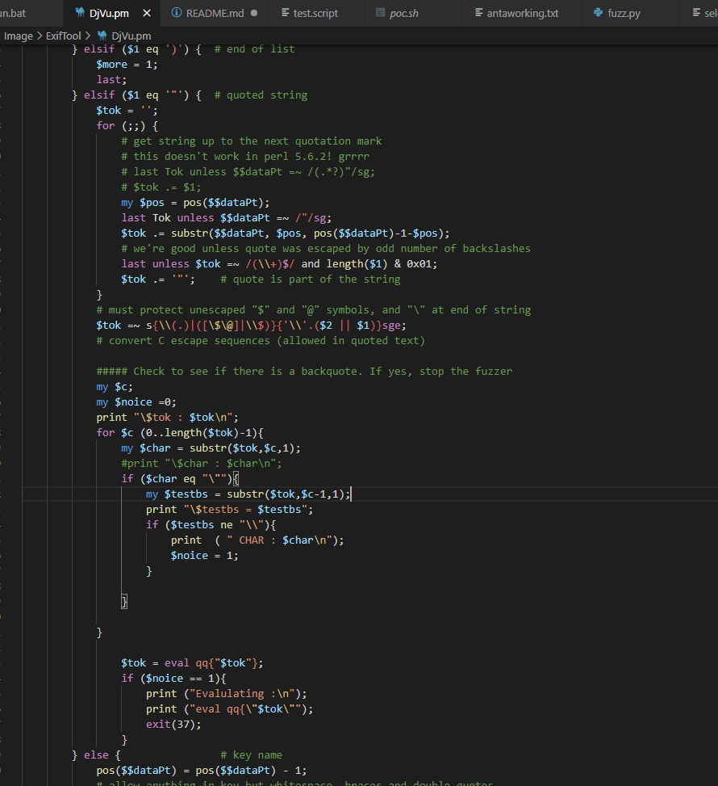

# CVE 2021-22204
This folder contains :
-   `payloads` folder containing payloads that triggers a crash
-   mutateList to see the different payloads attempted during the fuzzing
-   `poc.sh` to show an example of a crash in the fuzzer
-   `run.sh` to run djvumake file against `test.script` which is also used by the fuzzer 
-   `test.script` is the content that we want to add in the ANTa section
-   `sample.script` is used by the fuzzer as a template to generate `test.script`
-   `anta.txt` and `antaworking.txt` can be used by editing `run.sh`
-   `sample2.djvu` is the POC djvu file generated by the fuzzer.
-   `fuzz.py` is the fuzzer used for this research
    - Note that you would require djvumake. This was tested in Kali machine.
    -   REMEMBER TO EDIT THE `DjVu.pm` FILE IN `lib/Image/ExifTool/` directory as shown 

 

# Demo

